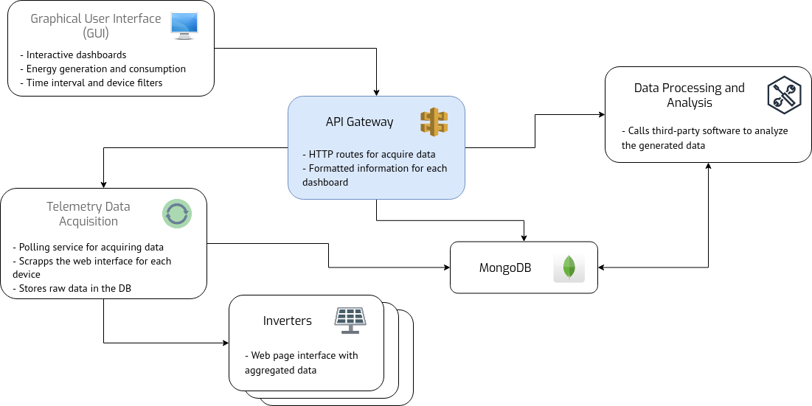

# cpid-solar-gateway
Gateway service for interacting with third-party software and databases for the CPID photovoltaic system

## General application

This service represents the gateway for externalizing data to the user interface in the CPID PV System monitoring. Its main role is to have plenty of HTTP endpoints for supplying all the needs of the GUI dashboards, minimizing the DB calculations made on each request.

The data that should be available through this service must be:

1. The generated energy in the PV system (TODO)
2. The consumed energy in the CPID (TODO)
3. The energy balance (TODO)
4. The current state and history for every inverter

## Data models and relationships

In order to display the required data, some models have been defined in the given service. The `Inverter` class has the current state for each device in the PV system, while the `TelemetryData` class the average measurements for a time interval (~5 minutes). Support classes like `TelemetryHourlyData`, `TelemetryDailyData`, `TelemetryWeeklyData`, `TelemetryMonthlyData` and `TelemetryYearlyData` are necessary for synchronizing the information for each device and obtain the system total.

## Required environment variables

Following the `.env.example` file, the required configuration for this service is:

1. DB_HOST: the name or address that identifies the MongoDB instance  
2. DB_PORT: the port of the MongoDB instance  
3. DB_USER: the user with permissions in the DB  
4. DB_PASSWORD: the password for the given user  
5. DB_DATABASE: the database for which the user has permissions  
6. MODE: the execution mode of the service. Can be `debug` or `release`  
7. SERVICE_PORT: the port on which the service will listen  
